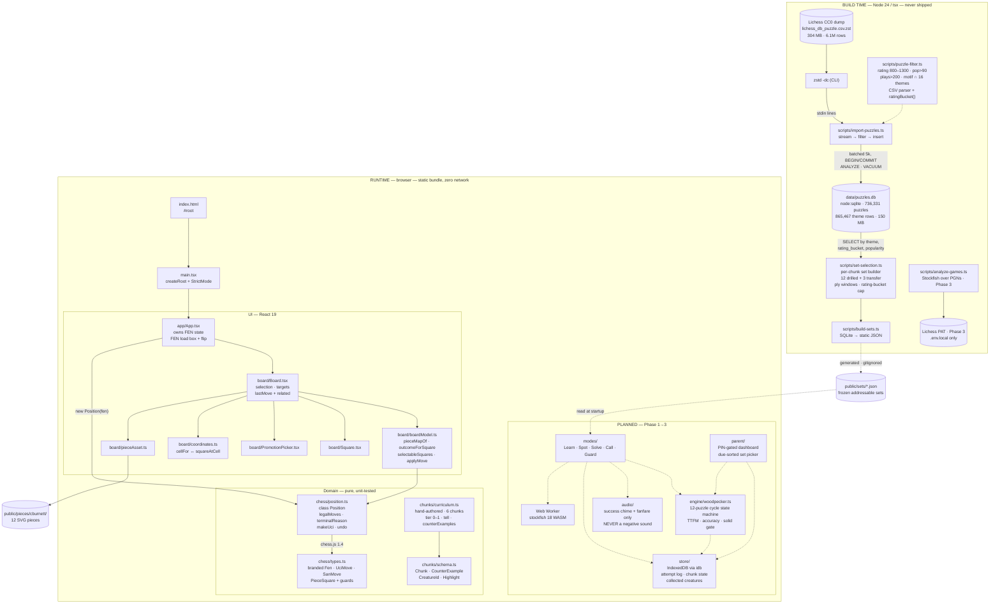

# Architecture — Chunk Chess

Pattern-recognition trainer for one 6-year-old. Local-first, no server, no auth.
Diagrams only; rationale lives in `CLAUDE.md` and `REQUIREMENTS.md`.

---

## The one rule

```
┌─────────────────────────┐        ┌─────────────────────────┐
│  BUILD TIME             │        │  RUNTIME                │
│  Node 24 / tsx          │        │  browser, static bundle │
│                         │        │                         │
│  stream, filter, select │  ───▶  │  read JSON, play, store │
│  node:sqlite            │  JSON  │  IndexedDB              │
│                         │        │                         │
│  NOT shipped            │        │  zero network calls     │
└─────────────────────────┘        └─────────────────────────┘

The browser never speaks to SQLite.
```

Frozen puzzle sets are what make this possible: a repetition trainer needs
addressable, immutable sets, so there is nothing for a server to do at runtime.

---

## System overview



---

## Build-time pipeline

```
data/lichess_db_puzzle.csv.zst
        │
        │  zstd -dc   (spawned child, stdout piped)
        ▼
   stdin — one CSV line at a time, never buffered whole
        │
        ▼
  ┌───────────────────────────────────────────────────────────┐
  │ parseRow        → malformed CSV / non-numeric            │
  │ passesFilter    rating 800–1300                          │
  │                 popularity > 90      → droppedRating     │
  │                 plays > 200          → droppedPopularity │
  │                 themes ∩ motifThemes → droppedPlays       │
  │                                    → droppedThemes       │
  │ parseMoves      UCI tokens, even ply count → droppedMalformed
  │ solutionIsPlayable   sampled 1-in-50     → droppedIllegal │
  └───────────────────────────────────────────────────────────┘
        │
        ▼
  INSERT INTO puzzles              (INSERT OR IGNORE → droppedDuplicate)
  INSERT INTO puzzle_themes        (one row per matching motif theme)
        │
        │  every 5,000 rows → COMMIT, then BEGIN
        ▼
  COMMIT · ANALYZE · VACUUM · CREATE INDEX
        │
        ▼
  data/puzzles.db
  indexed by (theme, rating_bucket, popularity DESC, puzzle_id)
  736,331 puzzles · 865,467 theme rows · 150 MB
```

```
set-selection.ts — per chunk
────────────────────────────────────────────────────────────
  candidates (by theme, rating band)
        │
        ├─▶ outsidePlyWindow        tier 0: 2–4 · t1: 4–6 · t2: 4–8 · t3: 6+
        ├─▶ noRequiredTheme
        ├─▶ claimedByAnotherChunk   cross-chunk exclusivity
        ├─▶ trivialRecapture        pawn takes non-pawn on move 1
        │                           (exempt: hangingPiece)
        ├─▶ notReplayable           re-verified at 100%, not 1-in-50
        ├─▶ opponentAlreadyInCheck
        ├─▶ ratingBucketFull        max 6 per 100-pt bucket
        │
        ▼
  orderCandidates:  popularity ↓  →  rating ↑  →  id
        │
        ├──▶ 12 drilled  ──┐
        └──▶  3 transfer ──┴──▶ SetPuzzle[]  ──▶ build-sets.ts ──▶ public/sets/*.json
```

---

## Runtime module graph

```
                        main.tsx
                           │
                        App.tsx ────────── owns Fen state
                           │
        ┌──────────────────┼──────────────────┐
        │                  │                  │
    Board.tsx         position.ts        curriculum.ts
        │                  │                  │
   ┌────┼────┐             │              schema.ts
   │    │    │             │
Square Promo coords    types.ts
   │          │        (branded)
pieceAsset
   │
public/pieces/cburnett/  (12 Cburnett SVGs)


  boardModel.ts ──▶ position.ts     pure decision layer,
  no React, no DOM                   fully unit-tested
```

```
Planned Phase 1 wiring — none of this exists yet

  public/sets/*.json ──▶ modes/ ──▶ engine/woodpecker.ts ──▶ store/ (IndexedDB)
                          │                 │                       │
                       audio/           parent/ ◀───────────────────┘
                    (chime only)      (PIN gate, reads store)
```

---

## Data flow — one Woodpecker cycle

```
  parent picks set (dashboard, sorted by what's due)
        │
        ▼
  load 12 frozen puzzles from public/sets/*.json
        │
        ▼
  ┌─────────────────────────────────────────────┐
  │ for each puzzle:                            │
  │   render FEN ──▶ kid sees board             │
  │   t0 = first move committed                 │
  │   correct? ──▶ chime + advance              │
  │   wrong?   ──▶ SILENCE, glow, arrow, replay │
  │   record { puzzleId, ttfm, correct }       │
  └─────────────────────────────────────────────┘
        │
        ▼
  cycle accuracy ≥ 80% ?   cycle 2+ target = ½ of cycle-1 time
        │
        ▼
  3 consecutive cycles: ≥90% accuracy AND ≤50% of cycle-1 time
        │
        ▼
  SOLID (provisional) ──▶ transfer test: 3 fresh puzzles + 2 counter-examples
        │                             │
     pass ▼                        fail ▼
   collect creature          back to drilling, counter-examples rotated in
        │
        ▼
  maintenance: 1, 3, 7, 16, 35 days
```

---

## Current state

| Check | Result |
|---|---|
| `npm test` | 73 passed — 38 board, 35 counter-examples |
| `npm run lint` | clean |
| `npm run typecheck` | 2 errors — `scripts/set-selection.ts:33,42` |

Phase 0 ~80% complete. Phase 1 not started: no `modes/`, `engine/`, `store/`,
`parent/`, `audio/`. `public/sets/` empty. `App.tsx` is a dev harness.

| Module | Status |
|---|---|
| `chess/types.ts` · `chess/position.ts` | done, tested |
| `board/*` | done, tested |
| `chunks/schema.ts` · `curriculum.ts` | done (6 chunks, tier 0–1) |
| `scripts/puzzle-filter.ts` | done |
| `scripts/import-puzzles.ts` | done — 736,331 rows kept |
| `scripts/set-selection.ts` | done, tested |
| `scripts/build-sets.ts` | done — 6 sets × (12 drilled + 3 transfer) |
| `scripts/analyze-games.ts` | Phase 3 |

## Invariants

Derived from `CLAUDE.md §7`. Enforced by review, not by code.

```
  local-first        no auth · no sync · no backend · ever
  piece set          Cburnett, always
  audio              success only — errors are SILENT
  no punishment      no lives · no decay · no "7/12"
  no session timer   the unit is the 12-puzzle set
  no random puzzles  frozen addressable sets only
  tier unlock        on measured transfer, never on puzzle rating
  set choice         the parent picks; the scheduler only sorts by due
  no comments        names carry the intent
```
